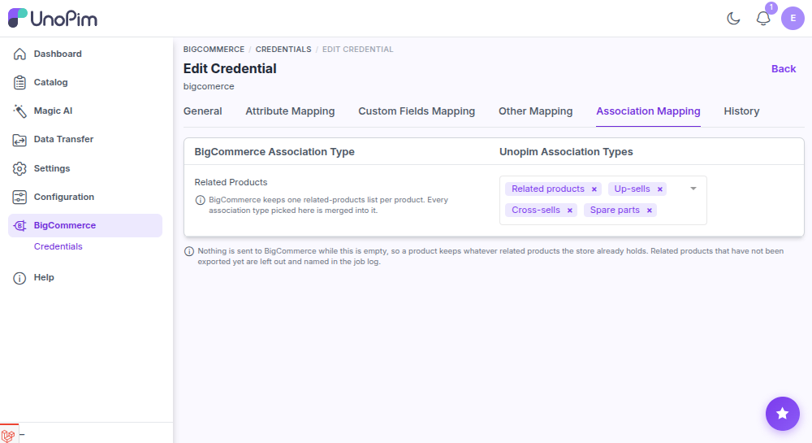

# Association mapping

BigCommerce keeps a single **related products** list on each product. The **Association Mapping** tab tells the connector which UnoPim **association types** feed that list when you export products.

**Open it from:** *BigCommerce → Credentials → edit a credential → **Association Mapping** tab*

## What you'll see

The page lists BigCommerce's association targets with two columns:

| Column | What it means |
|--|--|
| **BigCommerce Association Type** | The BigCommerce list the associations are sent to. Currently **Related Products**. |
| **Unopim Association Types** | Pick one or more UnoPim association types (e.g. *related*, *cross-sells*, *up-sells*). Every type you pick is merged into the single BigCommerce related-products list. |

The mapping is **per credential** - different stores can pull from different association types.

## How it behaves on export

- If you leave the mapping **empty**, nothing is sent and each product keeps whatever related products the store already holds.
- Related products that **haven't been exported yet** are left out of the list and named in the job log, so you can export them and re-run.
- The associations are only sent when the export job has **Export with Association** turned on - see [Export products](./export-products).

## Save the mapping

Pick the UnoPim association types and click **Save**. The mapping is used on the next product export run that has *Export with Association* enabled.
