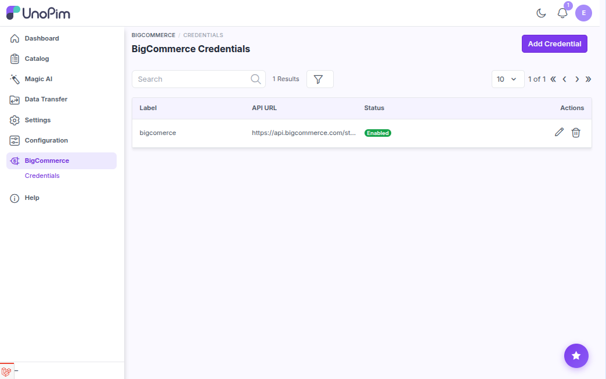
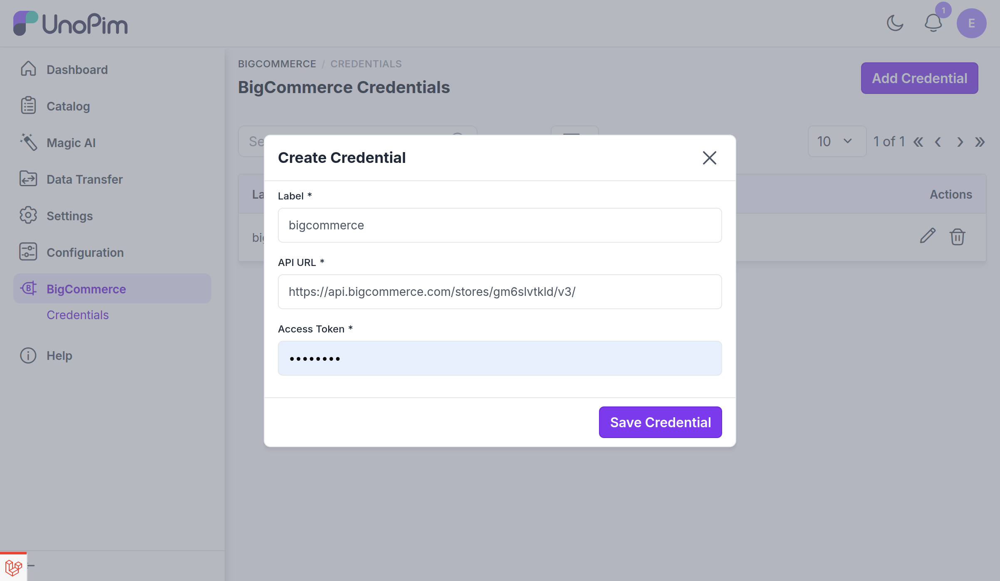
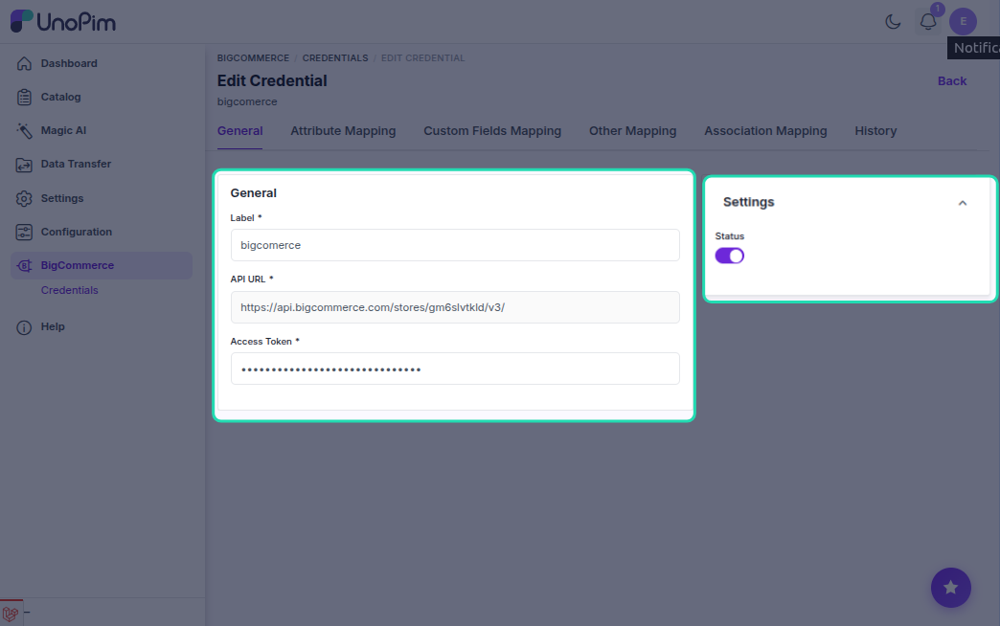

# Add BigCommerce credentials

This is where you store the API connection for your BigCommerce store. Add at least one credential before you can import or export anything.

**Open it from:** *BigCommerce → Credentials*

## The credentials page

Each row in the list shows one credential:

- **Label** - the name you gave it.
- **API URL** - the BigCommerce API endpoint.
- **Status** - whether the credential is active.

You can search by label, sort columns, or click **Filter** to narrow the list. The pencil icon edits a row, the trash icon deletes it.

---

## Generate the API account in BigCommerce

Before adding a credential in UnoPim, create an **API account** in BigCommerce:

1. Log into your BigCommerce admin.
2. Go to **Settings → API → Store-level API accounts**.

3. Click **Create API account**.

4. Pick the **Store API V2/V3 token** type.

5. Give it a name (e.g. *UnoPim Connector*) and set scopes:
   - **Products** - Modify (for export) or Read-only (import only).
   - **Information & Settings** - Read-only / Modify.

   

   

6. Save the account. BigCommerce shows the **Client ID**, **Client Secret**, **Access Token**, and **API path** **once** - copy them now.

> [!NOTE]
> The connector only needs the **API path** and the **Access Token**. BigCommerce still displays a Client ID and Client Secret, but you don't need to enter them in UnoPim.

You'll paste these into UnoPim next.

---

## Add a credential

In UnoPim, click **+ Create Credential** in the top-right corner.

<!-- TODO: capture screenshot - bigcommerce-add-credential.png - Create BigCommerce credential form -->

Fill in:

| Field | What goes here |
|--|--|
| **Label** | Any name you want, e.g. *Production Store*. Used to identify this credential everywhere. |
| **API URL** | The BigCommerce API path, e.g. `https://api.bigcommerce.com/stores/<store-hash>/`. Copy this from the BigCommerce API account screen. |
| **Access Token** | Access Token from the API account. |

Click **Save Credential**.

> The connector verifies the credentials against BigCommerce before saving. If the API URL or access token is wrong you see a clear error and nothing is stored.

A new credential is **active** by default. After saving, you land on its edit page, where each of the credential's mapping screens is available as a tab.

---

## Edit a credential

Click the pencil icon on any row. The edit page is organised into tabs:

| Tab | What it holds |
|--|--|
| **General** | The credential itself - see the fields below. |
| **Attribute Mapping** | [Attribute (standard) mapping](./standard-mapping) for this credential. |
| **Custom Fields Mapping** | [Custom mapping](./custom-mapping) for this credential. |
| **Other Mapping** | [Other mapping](./other-mapping) - images, brand, flags. |
| **Association Mapping** | [Association mapping](./association-mapping) - related products. |
| **History** | Every change to this credential and its mappings - see [Mapping history](./mapping-history). |

On the **General** tab you can:

- Change the **Label**.
- Replace the **Access Token** - it shows as `******************************`; leave it untouched to keep the current token, or type a new one to replace it.
- Toggle the **Status** (Active / Inactive). Inactive credentials are hidden from the import / export filter dropdowns.

The **API URL** is fixed once the credential exists and is shown read-only.

> The connector re-verifies the connection against BigCommerce whenever you save. If it can't reach the store with the new values, the change is rolled back and you see an error.

Click **Update Credential** when done.

> [!NOTE]
> Earlier versions asked for a Client ID, Client Secret, and per-credential locale / currency mapping on this page. Those are gone - the connector needs only the API path and access token, and export locale / currency are chosen per job on the [product export](./export-products) filters.

---

## Delete a credential

Click the trash icon on a row and confirm.

> [!CAUTION]
> Deleting a credential does **not** delete the products / categories already pushed to BigCommerce. It only stops future imports / exports from running through it.

