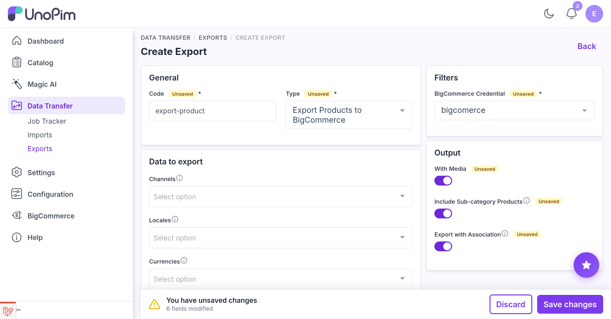
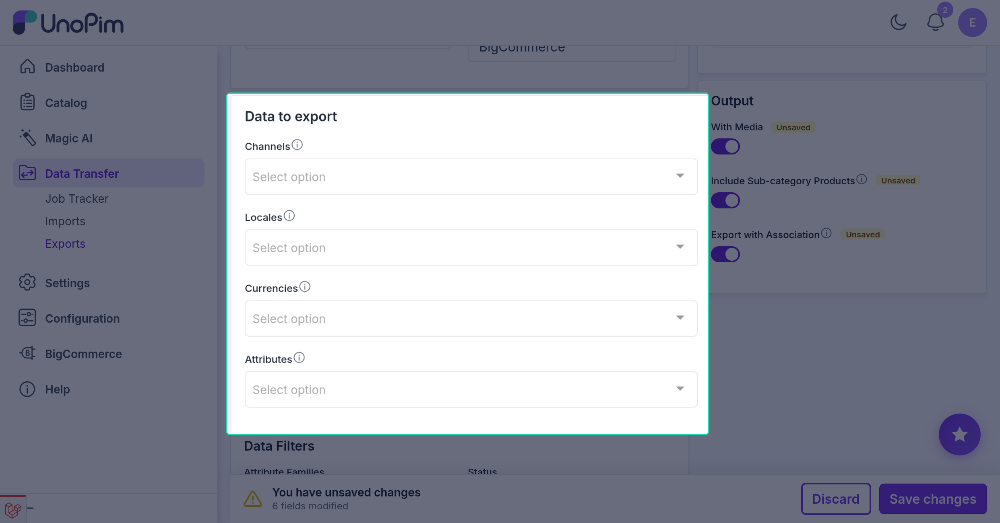
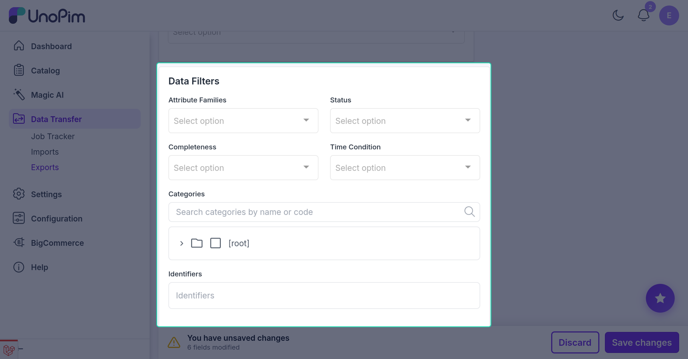
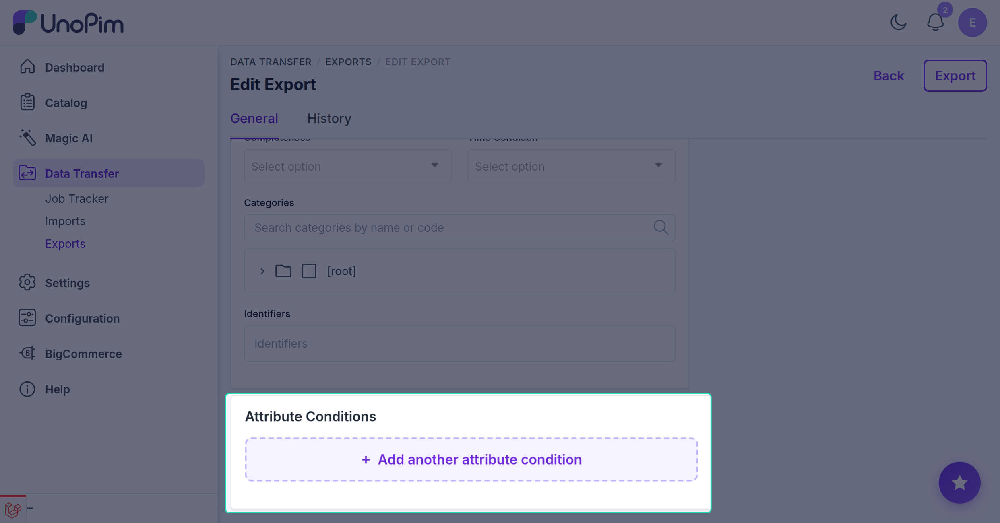

# Export products

Push **simple products** from UnoPim to BigCommerce - with attribute values, prices, stock, statuses, custom fields, and images.

For configurable products with variants, use [Export configurable products](./export-product-models).

> **Before you start.** Add a [BigCommerce credential](./credentials), configure [Attribute mapping](./standard-mapping), and run [Export categories](./export-categories) so the categories the products reference already exist in BigCommerce.

**Open it from:** *Data Transfer → Export*

## Steps

### 1. Create the profile

Open **Data Transfer → Export → + Create Export**.

Set the **Type** to **Export Products to BigCommerce** and give it a **Code** - any short identifier, e.g. `bigcommerce_products`. Pick the **Credential** (the BigCommerce store to push to; only **active** credentials appear) - it is the only required field.

### 2. Choose what to export

Everything except the credential is optional. The filters are grouped into four areas on the export form. Leave a whole area empty to skip it - an export with no filters pushes every eligible simple product visible to the user.

#### Data to export

Controls *which values* are sent for each product.

| Filter | What it does |
|--|--|
| **Channels** | Limit the export to the selected channel(s). |
| **Locales** | Which locales' values to send. Depends on the chosen channel(s). |
| **Currencies** | Which currencies' prices to send. Depends on the chosen channel(s). |
| **Attributes** | Send only the selected attributes' values. |

> [!NOTE]
> If you don't pick a channel or locale, the job falls back to the store's **default channel and locale**.

#### Data filters

Controls *which products* are included.

| Filter | What it does |
|--|--|
| **Attribute Families** | Export only products in the selected families. |
| **Status** | *Enabled*, *disabled*, or *all* products. |
| **Completeness** | *None*, *at least one*, or *all* - based on how complete the product data is. |
| **Time Condition** | Export by date: *last N days*, *since last export*, or *between two dates* (extra date / number fields appear when relevant). |
| **Categories** | Export only products in the selected categories. |
| **Identifiers (SKU)** | Export only the listed SKUs. Paste-friendly - one per line or comma-separated. |

#### Attribute conditions

Build one or more rules on attribute values (e.g. *brand = Acme*). Only products whose attributes match the conditions are exported. Click **+ Add another attribute condition** to add a rule.

#### Output

Extra options in the **Output** panel on the right.

| Option | What it does |
|--|--|
| **With Media** | Also send the product's images. |
| **Include Sub-category Products** | Also export products filed under any category beneath the ones selected. |
| **Export with Association** | Send product associations to BigCommerce as related products (configure them on [Association mapping](./association-mapping)). |

### 3. Save and run

Click **Save changes**, then open the profile and click **Export Now**.

The job is queued. Watch progress in the Data Transfer Tracker.

