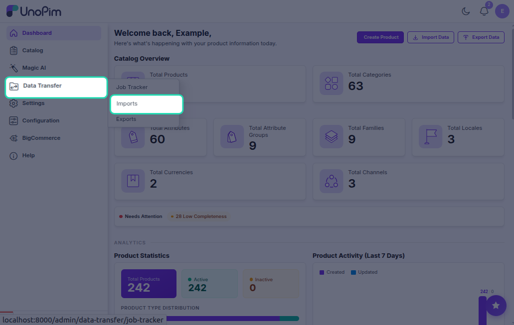
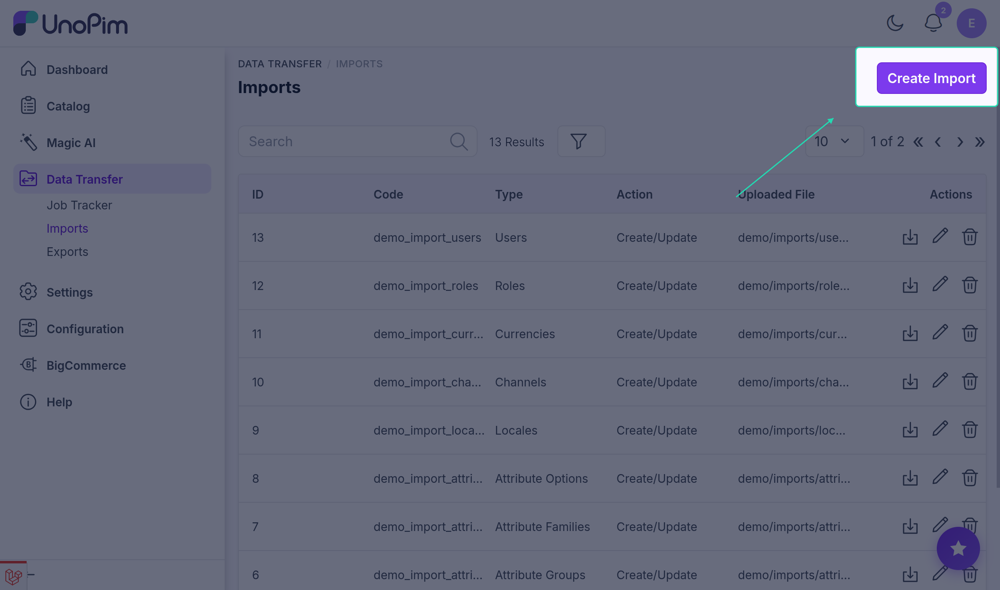
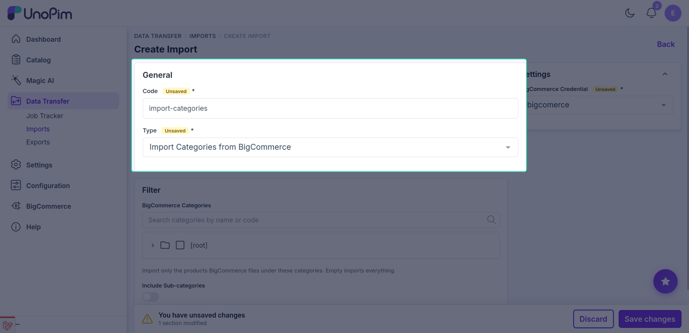
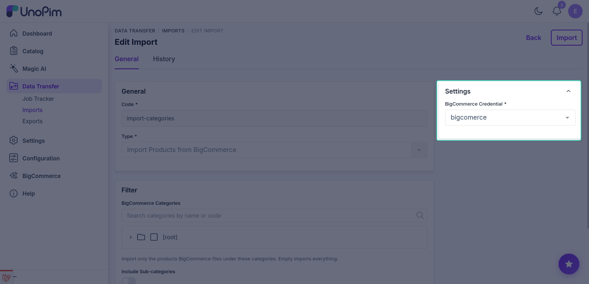
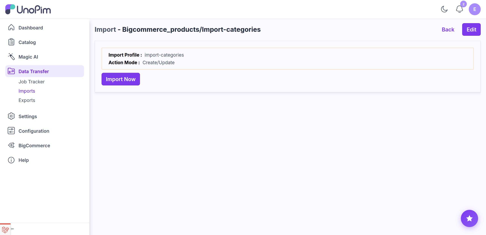

# Import categories

Pull your BigCommerce category tree into UnoPim, keeping the parent / child hierarchy intact.

> **Before you start.** Add a [BigCommerce credential](./credentials).

**Open it from:** *Data Transfer → Import*

## Steps

### 1. Create the profile

1. Open **Data Transfer → Import → + Create Import**.

2. **Type** - pick **Import Categories from BigCommerce**, **Code** - any short identifier, e.g. `bigcommerce_categories_import`.

3. **Set the import filters**

BigCommerce imports take a single filter, in the **Settings** panel on the right of the form:

| Filter | Required | What it does |
|--|--|--|
| **BigCommerce Credential** | ✓ | Which BigCommerce store to pull from. Only **active** credentials appear in the dropdown. |

> [!NOTE]
> Imports have **no other filters** - the job pulls the **whole** category tree from the selected store, keeping the parent / child hierarchy intact.

Click **Save Import**.

4. **Run it**

Open the profile and click **Start Import**.

The job is queued. Watch progress in the Data Transfer Tracker.

