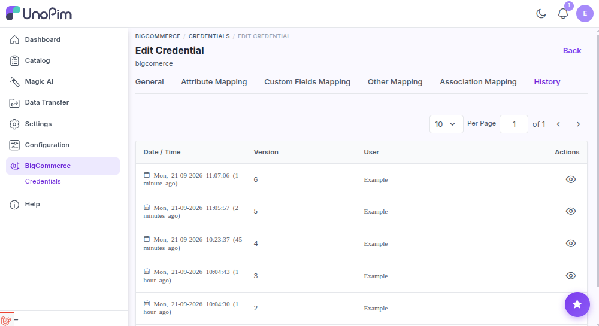

# Mapping history

Every change made to a credential and its [attribute](./standard-mapping), [custom](./custom-mapping), [other](./other-mapping), or [association](./association-mapping) mapping is recorded automatically. Use the history to see *who changed what, when*.

History now lives **with the credential**: each credential keeps its own change log, covering the credential's own settings and all of its mappings.

**Open it from:** *BigCommerce → Credentials → edit a credential → **History*** (the history panel on the credential's edit page)

## What's recorded

Each entry is one change, with:

- **Who** made the change and **when**.
- The **action** - created, updated, or deleted.
- The complete **before / after** state, so you can see which fields were added, removed, or repointed to a different attribute.

Because the credential and its mappings share one history, you can follow the whole story of a store's configuration in a single place - from the credential being created through every mapping tweak since.

---

## What's not recorded

- Changes to **products / categories** themselves - the connector doesn't audit your catalog, only the credential and its mappings.
- Job runs (imports / exports). Those live in the **Data Transfer Tracker**, where each job also shows any warnings it raised.

---

## Use history to debug an export

If yesterday's export sent products with the wrong values, the history is the first place to look:

1. Open **BigCommerce → Credentials** and edit the credential that ran the export.
2. Open its **History**.
3. Look for changes around the time before yesterday's run.
4. Open a suspicious entry and confirm which field moved in the before / after view.

This narrows down whether the problem is a mapping issue (recent change → fix here) or a catalog issue (no mapping changes → check the source data).
