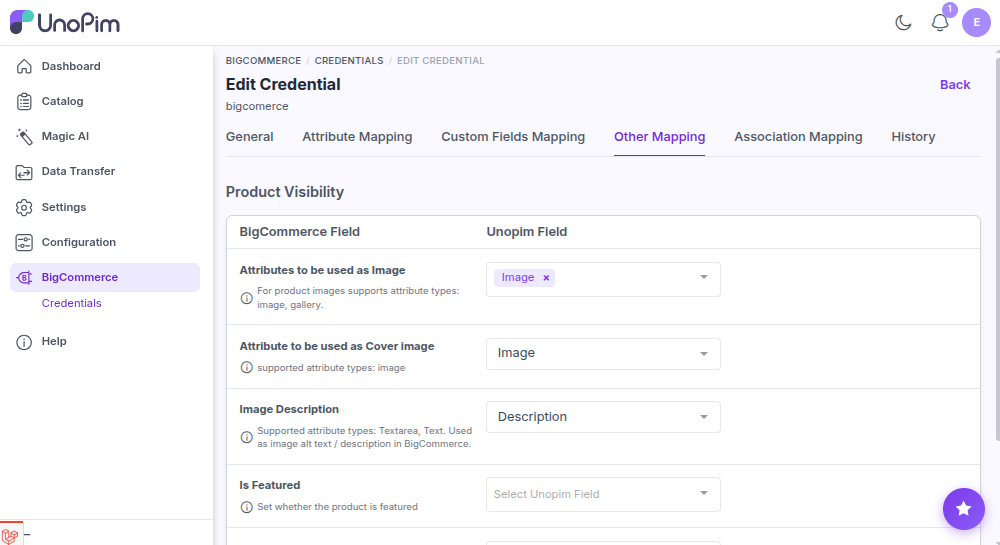

# Other mapping

You can use the **Other Mapping** tab to configure additional BigCommerce product fields that are not covered under Attribute Mapping - product images, brand, and visibility flags.

**Open it from:** *BigCommerce → Credentials → edit a credential → **Other Mapping** tab*

The fields are grouped into two sections:

## Image Mapping

| Field | UnoPim attribute types | What it does |
|--|--|--|
| **Attributes to be used as Image** | Image, Gallery, **Asset (DAM)** | The attributes whose values are exported as the product's images. You can pick more than one. |
| **Attribute to be used as Cover Image** | Image, Asset (DAM) | The attribute used as the product's main / thumbnail image in BigCommerce. |
| **Image Description** | Text, Textarea | The attribute used as the image alt text / description. |

> [!NOTE]
> DAM assets can be mapped directly as image fields - the DAM bundle stays optional. Non-image assets and unreachable images are skipped rather than breaking the export, and a warning is recorded on the job.

## Product Visibility

| Field | UnoPim attribute types | What it does |
|--|--|--|
| **Is Featured** | Boolean, Simple Select | Marks the product as featured in BigCommerce. |
| **Is Free Shipping** | Boolean, Simple Select | Controls free shipping for the product. |
| **Brand ID** | Simple Select | Assigns the product to a BigCommerce brand. If the brand doesn't exist on the store yet, the connector creates it. |

## Save the mapping

After configuring the fields, click **Save**. The updated mapping is used in the next product export run.
