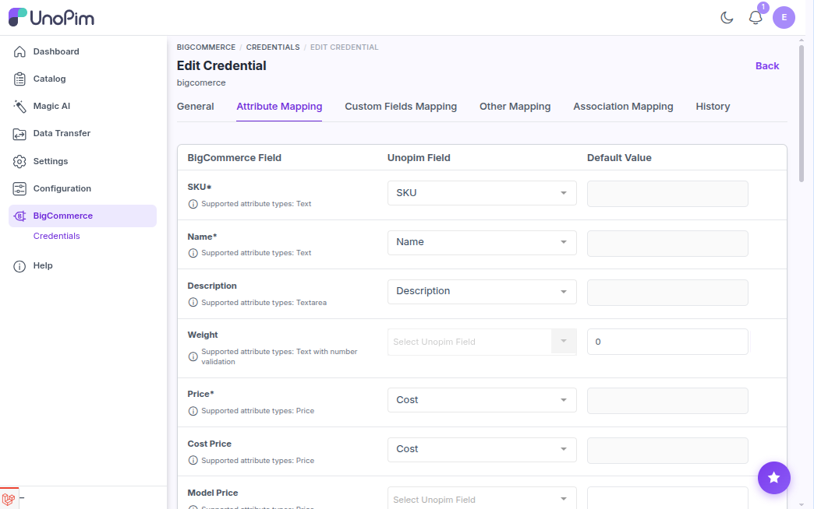
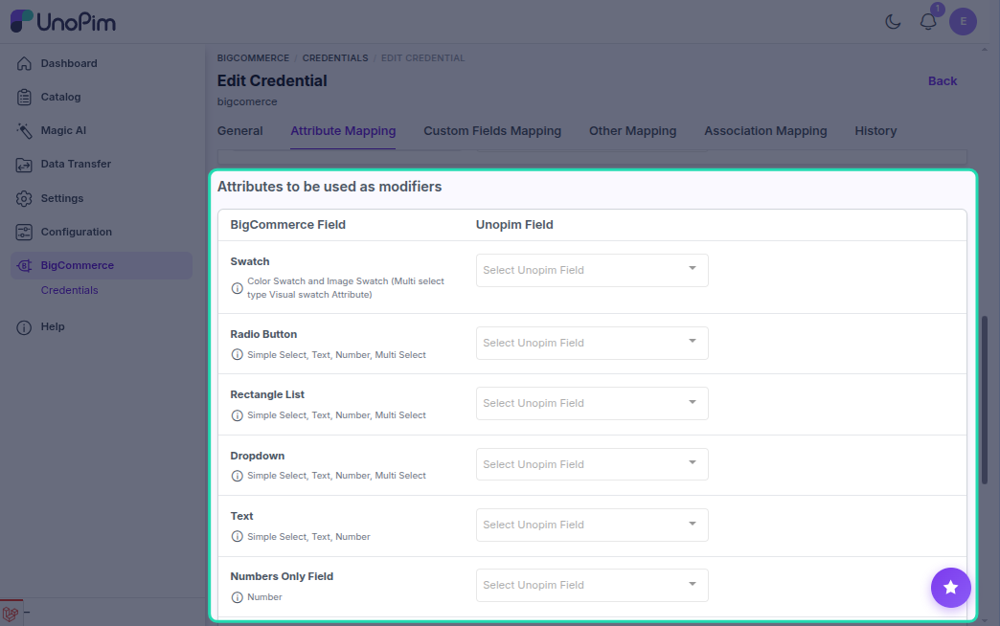
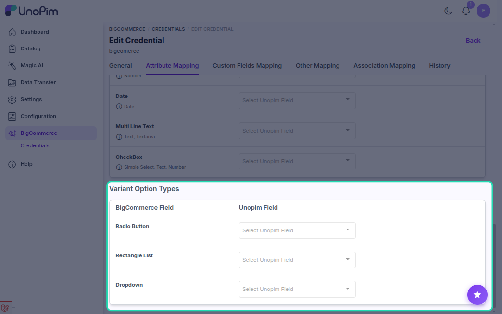
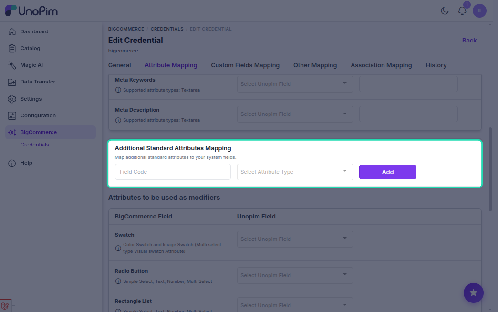

# Attribute mapping

You need to map UnoPim attributes with BigCommerce product fields before exporting products to your BigCommerce store.

While exporting products from UnoPim to BigCommerce, the connector sends product information based on the attribute mapping you configure for that credential.

**Open it from:** *BigCommerce → Credentials → edit a credential → **Attribute Mapping** tab*

## Attribute mapping fields

You can map the following BigCommerce product fields with UnoPim attributes:

- `SKU` *(required)*
- `Name` *(required)*
- `Description`
- `Weight`
- `Price` *(required)*
- `Cost Price`
- `Model Price`
- `Product Type`
- `Inventory Level`
- `Meta Title`
- `Meta Keywords`
- `Meta Description`

Product **images**, **brand**, **featured / free-shipping** flags, and **visibility** are configured on the [Other mapping](./other-mapping) tab, not here.

## What you'll see

The page lists BigCommerce product fields with three columns:

| Column | What it means |
|--|--|
| **BigCommerce Field** | The built-in BigCommerce field you're mapping into. Hover the info icon for the attribute types it accepts. |
| **Unopim Field** | Pick the UnoPim attribute whose value populates this field. The dropdown is filtered to the types the field accepts. |
| **Default Value** | An optional fallback the connector sends when the mapped attribute has no value (for example `0` for weight, or `physical` for product type). |

The mapping is **per credential** - it belongs to the credential whose tab you opened. Different stores can have different mappings.

> [!TIP]
> Mappings are validated when you save. If an attribute's type doesn't match what the BigCommerce field expects, the save is refused with a message instead of failing silently at export time.

Below the main field table are two more sections that shape how **configurable products** are exported. Both are optional and only apply to configurable-product exports.

## Attributes to be used as modifiers

**Modifiers** are options a shopper picks on the product page that *don't* create separate variants (SKUs) - a gift message, a monogram, a delivery date, a fabric swatch, and so on. This section maps UnoPim attributes to BigCommerce modifier **input types**.

Each row is one BigCommerce modifier input type. Pick the UnoPim attribute that should feed it - the dropdown is filtered to the attribute types that input type accepts, and the info icon spells them out.

| BigCommerce modifier | Accepts UnoPim attribute types |
|--|--|
| **Swatch** | Multi Select / Simple Select visual-swatch attribute (colour or image swatch) |
| **Radio Button** | Simple Select, Text, Number, Multi Select |
| **Rectangle List** | Simple Select, Text, Number, Multi Select |
| **Dropdown** | Simple Select, Text, Number, Multi Select |
| **Text** | Simple Select, Text, Number |
| **Numbers Only Field** | Number |
| **Date** | Date |
| **Multi Line Text** | Text, Textarea |
| **CheckBox** | Simple Select, Text, Number |

Every row is optional - map only the modifier types your store uses.

## Variant Option Types

BigCommerce **variant options** are the axes that generate a product's variants - the choices (e.g. *Size*, *Colour*) whose combinations each become a purchasable SKU. This section controls how each mapped axis is **displayed** on the storefront.

Map the UnoPim attribute that drives each display style:

| BigCommerce option display | Accepts UnoPim attribute types |
|--|--|
| **Radio Button** | Simple Select |
| **Rectangle List** | Simple Select |
| **Dropdown** | Simple Select |

The mapped attributes become the variation axes on the exported BigCommerce variable product - see [Export configurable products](./export-product-models). All rows are optional.

## Required mappings

At minimum, map these to run a product export:

| BigCommerce Field | Typical UnoPim attribute |
|--|--|
| **Name** | `name` |
| **SKU** | `sku` |
| **Price** | `price` |
| **Weight** | `weight` (or fixed value `0`) |
| **Type** | `physical` or `digital` - usually a fixed value attribute. |

The rest are optional. BigCommerce uses default values for any unmapped optional field.

## Add an additional attribute

Some BigCommerce stores need a few extra product fields that are not shown by default. Use **+ Add Additional Attribute** at the bottom of the page to expose them:

1. Click **+ Add Additional Attribute**.
2. Pick the BigCommerce field from the dropdown.
3. Pick the matching UnoPim attribute.

Click the trash icon next to a row to remove an additional attribute.

## Save the mapping

Click the **Save** button. You'll see a success message.

