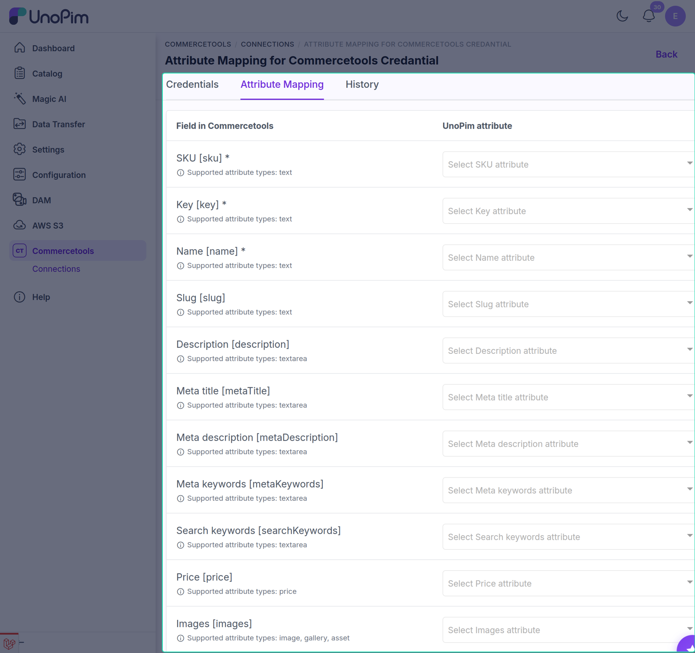

# Attribute Mapping

Before you can export or import products, you need to tell the connector which UnoPim attribute maps to which commercetools product field. This is called **attribute mapping** - and you only need to set it up once for each connection.

---

## How to Access Attribute Mapping

Go to **Commercetools → Connections**, click **Edit** on your connection, then open the **Attribute Mapping** tab.

On this screen, the left side lists the commercetools product fields. For each field, use the dropdown on the right to select the matching UnoPim attribute.

---

## Available Field Mappings

| commercetools Field | Field Code | What it does | Supported attribute types |
|---|---|---|---|
| **SKU** *(required)* | `sku` | The SKU of each product variant | text |
| **Key** *(required)* | `key` | A unique key that identifies the product in commercetools | text |
| **Name** *(required)* | `name` | The product name shown on your storefront | text |
| **Slug** | `slug` | The URL-friendly part of the product page address (e.g. `blue-running-shoes`) | text |
| **Description** | `description` | The full product description | textarea |
| **Meta title** | `metaTitle` | Page title used by search engines | textarea |
| **Meta description** | `metaDescription` | Description shown in search engine results | textarea |
| **Meta keywords** | `metaKeywords` | SEO keywords for the product page | textarea |
| **Search keywords** | `searchKeywords` | Words customers can search for to find the product | textarea |
| **Price** | `price` | The product price | price |
| **Images** | `images` | Product images. You can select more than one attribute. | image, gallery, asset |

The dropdown only lists UnoPim attributes whose type matches the field, so a wrong type can't be picked by mistake.

Click **Save Mapping** when you're done.

> **Important:** **SKU**, **Key** and **Name** must be mapped before any product export or import can run. Until they are, product jobs stop with the message *"The selected connection has no attribute mappings configured."*

> **Note:** The **asset** type is only available when the UnoPim **DAM** package is installed.

---

## Other Product Attributes

Any other attribute on a commercetools product type is filled from the UnoPim attribute that has the **same code**. For example, a commercetools attribute called `color` is filled from the UnoPim attribute `color`.

You don't need to map these - just make sure the codes are the same on both sides. The easiest way to do that is to export your attribute families to commercetools, or import your product types from commercetools, before exporting products. See [Export Jobs](./export-jobs) and [Import Jobs](./import-jobs).
