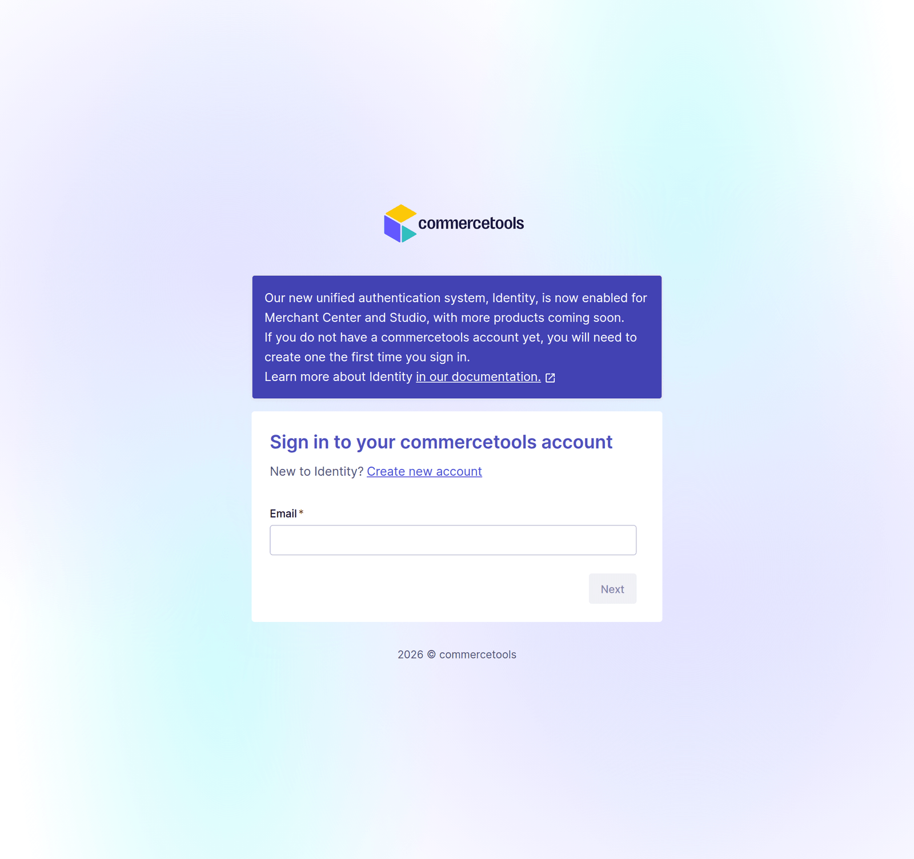
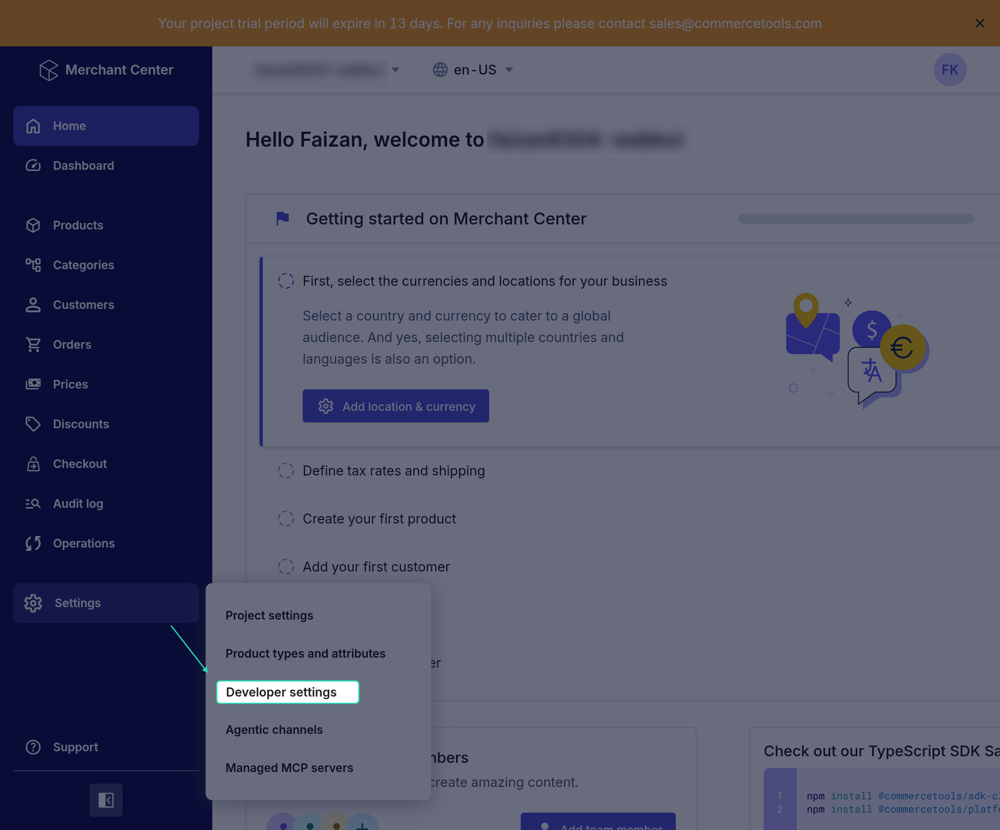
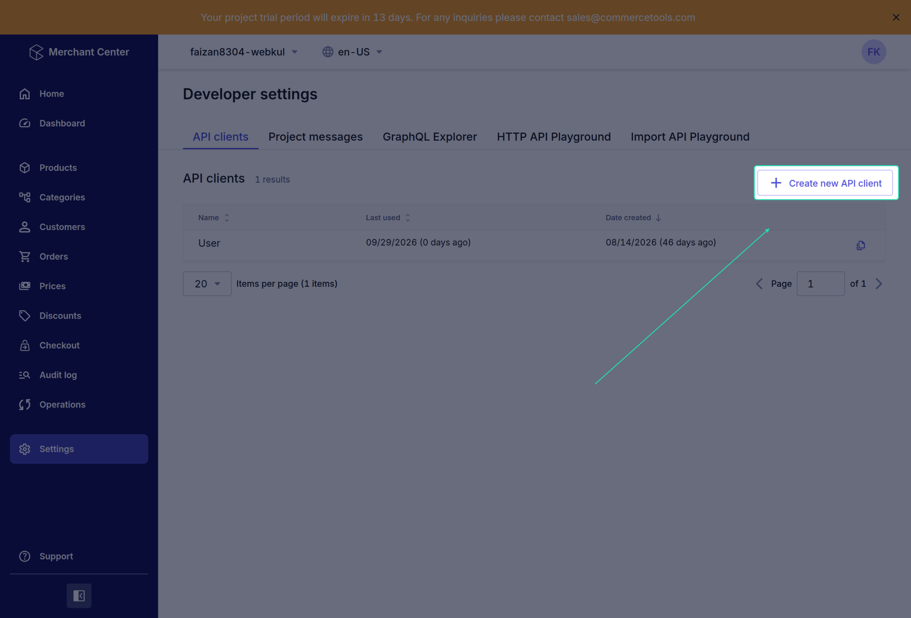
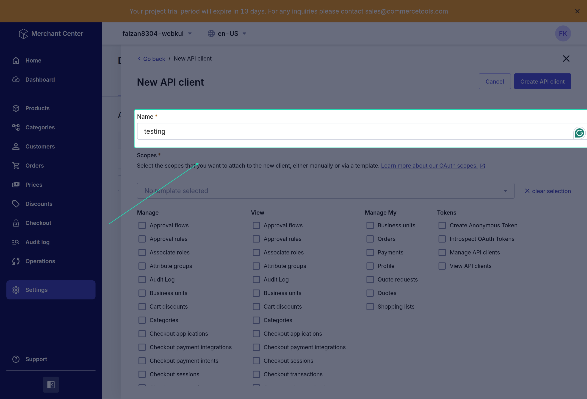
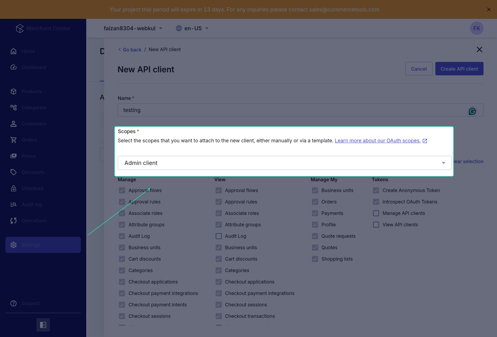

# Before You Begin - commercetools API Client

Before installing the UnoPim Commercetools Connector, you need to do one thing on the commercetools side: **create an API client**. This is what allows UnoPim to talk to your commercetools project securely.

The whole process takes about 5 minutes. Just follow the steps below.

---

## Step 1 - Open the Merchant Center

Log in to the [commercetools Merchant Center](https://mc.commercetools.com) and open the project you want to connect.

## Step 2 - Go to Developer Settings

In the left menu, click **Settings**, then click **Developer settings**.

## Step 3 - Create a New API Client

On the **API clients** tab, click **Create new API client**.

## Step 4 - Name Your API Client

Enter a name for the client - something like **UnoPim Connector**.

## Step 5 - Choose the Scopes

Scopes decide what UnoPim is allowed to do in your project. The simplest option is to pick the **Admin client** template from the dropdown, which gives full access (`manage_project`).

If you prefer tighter access, select only these scopes:

| Scope | Why UnoPim needs it |
|---|---|
| `manage_products` / `view_products` | Export and import products |
| `manage_categories` / `view_categories` | Export and import categories |
| `manage_product_types` / `view_product_types` | Export attribute families and import product types |

> **Note:** If you only plan to export, the `manage_*` scopes are enough. If you only plan to import, the `view_*` scopes are enough.

Click **Create API client**.

## Step 6 - Copy Your Credentials

commercetools now shows your new credentials. Copy these values and keep them somewhere safe - you'll enter them in UnoPim later:

| Value | Example |
|---|---|
| **project_key** | `my-shop` |
| **client_id** | `a1b2c3d4e5f6...` |
| **secret** | `Xy9...` |
| **scope** | `manage_project:my-shop` |
| **API URL** | `https://api.europe-west1.gcp.commercetools.com` |

> **Important:** The **secret** is shown **only once**. If you close this screen without copying it, you'll have to create a new API client.

## Step 7 - Find Your Region

UnoPim asks for your project's **region**. You can read it from the **API URL**: it's the part between `api.` and `.commercetools.com`.

| API URL | Region |
|---|---|
| `https://api.europe-west1.gcp.commercetools.com` | `europe-west1.gcp` |
| `https://api.us-central1.gcp.commercetools.com` | `us-central1.gcp` |
| `https://api.eu-central-1.aws.commercetools.com` | `eu-central-1.aws` |
| `https://api.us-east-2.aws.commercetools.com` | `us-east-2.aws` |

---

You're all set on the commercetools side. Head over to [Installation](./installation) to continue setting up the connector in UnoPim.
