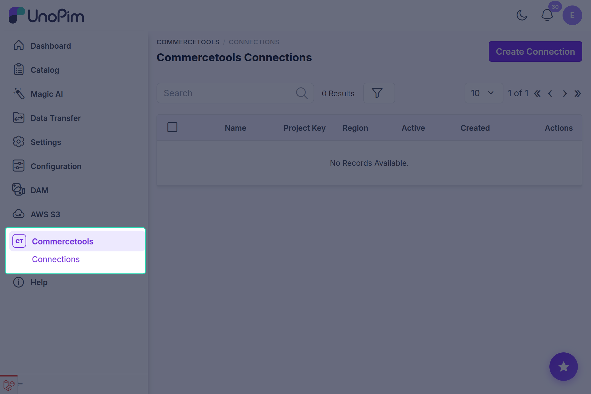
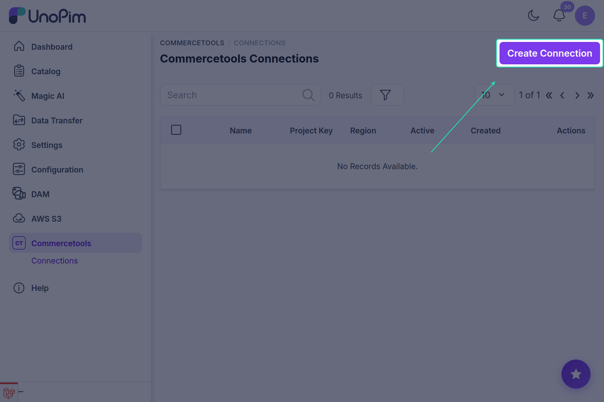
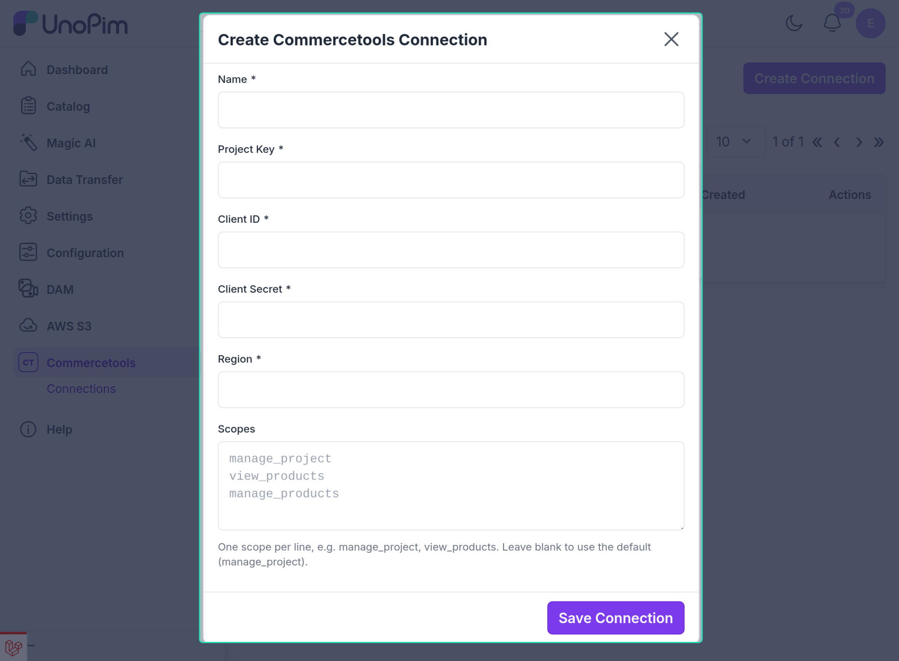
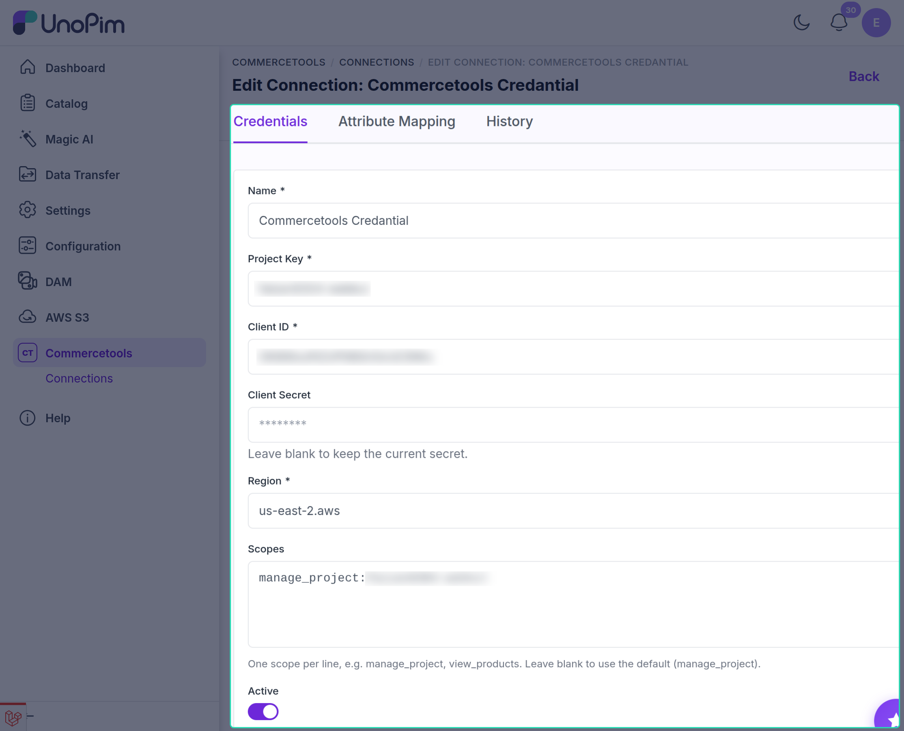

# Setting Up the UnoPim Connection

Once the connector is installed, the next step is to connect your commercetools project to UnoPim. This is done by creating a **connection** with the API client details you copied in [commercetools Setup](./commercetools-setup).

---

## Step 1 - Open Connections

Click **Commercetools** in the left sidebar of your UnoPim dashboard, then click **Connections**.

---

## Step 2 - Create a New Connection

Click **Create Connection** in the top-right corner.

Fill in the following details:

| Field | What to enter |
|---|---|
| **Name** | A name to recognise this project in UnoPim (e.g. `My Shop Production`) |
| **Project Key** | The `project_key` from your commercetools API client |
| **Client ID** | The `client_id` from your commercetools API client |
| **Client Secret** | The `secret` from your commercetools API client |
| **Region** | Your project region, e.g. `europe-west1.gcp` or `us-east-2.aws` |
| **Scopes** | One scope per line, e.g. `manage_project`. Leave blank to use `manage_project`. |

> **Note:** You don't need to add your project key to the scopes. Writing `manage_project` is enough - UnoPim adds `:your-project-key` for you. A scope copied from commercetools, such as `manage_project:my-shop`, also works.

Click **Save Connection**.

> **Note:** The same **Project Key** and **Client ID** pair can only be used for one connection.

---

## Step 3 - Review the Connection

After saving, you'll be taken to the connection edit screen. It has three tabs:

- **Credentials** - the details you just entered.
- **Attribute Mapping** - which UnoPim attribute feeds each commercetools field. See [Attribute Mapping](./attribute-mapping).
- **History** - every change made to this connection.

**Client Secret**
The secret is never shown again. Leave the field blank to keep the current secret, or type a new one to replace it.

**Active**
Only active connections can be used in export and import jobs. Turn this off to pause a connection without deleting it.

---

## Step 4 - Test the Connection

Go back to **Commercetools → Connections** and click the **Test** action on your connection's row. UnoPim tries to log in to commercetools with your details:

| Result | What it means |
|---|---|
| **Connected** | Everything works. The **Last Tested** time is updated. |
| **Failed** | The project key, client ID, secret, region or scopes are wrong, or commercetools could not be reached. The exact reason is shown in the message. |

Test the connection again after changing any credential.

---

## Connection History

Open the **History** tab on a connection to see every change: the version, the date and time, who made it, and the old and new value of each field. For the attribute mapping, only the fields that actually changed are listed.

The client secret is never saved in history.

---

## Connecting Multiple commercetools Projects

You can connect **more than one commercetools project** to the same UnoPim instance. Repeat the steps above and create a separate connection for each project.

From the **Connections** list you can also:

- **Toggle Active** - switch several connections on or off at once.
- **Delete Selected** - remove several connections at once.
