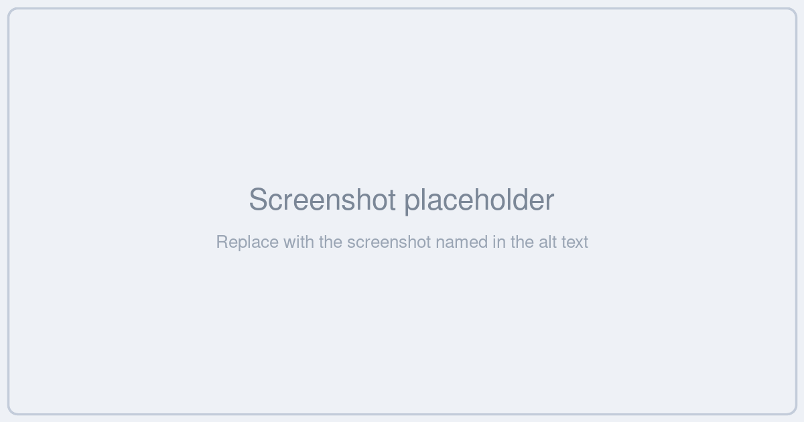

# Configuration

DAM has a settings page at **DAM → Configuration** for changing how the media library behaves — without editing `.env` or redeploying.



Change what you need and click **Save**. You will see *"Configuration saved successfully."* The relevant caches are cleared for you automatically.

> [!NOTE]
> Viewing the page requires `dam.configuration.index`; saving requires `dam.configuration.update`. Without the update permission the form is shown read-only.

---

## General Settings

*Configure directory tree visibility, explorer view, and bookmarks panel for the DAM media library.*

| Setting | Default | What it does |
|---|---|---|
| **Show Assets in Directory Tree** | Off | When enabled, asset files appear as leaf nodes inside the directory tree, not just folders. |
| **Enable Explorer View** | Off | Replaces the default asset grid with the multi-tab folder [Explorer](./explorer.md). |
| **Enable Bookmarks Panel** | Off | Shows a bookmarks panel below the directory tree for quick navigation. *Only visible once Explorer is enabled.* |
| **Show Directory Tree** | On | Shows the directory tree sidebar alongside the Explorer. *Only visible once Explorer is enabled.* |

The last two toggles stay hidden until Explorer is switched on:


### Show Assets in Directory Tree

Off by default, and that default is deliberate. With it on, the tree loads assets as well as folders, which is convenient on a small library and slow on a large one.


When enabled, assets load **lazily** — DAM fetches directories in batches of **100** with a **Load more** control, and only pulls a directory's assets when you actually expand it. Even so, on libraries with tens of thousands of assets you will feel the difference. Leave it off unless you need it.


---

## Environment Variables

The four settings above can also be set in `.env`. They map like this:

| Env var | Setting | Default |
|---|---|---|
| `DAM_TREE_SHOW_ASSETS` | Show Assets in Directory Tree | `false` |
| `DAM_EXPLORER_ENABLED` | Enable Explorer View | `false` |
| `DAM_EXPLORER_BOOKMARKS_ENABLED` | Enable Bookmarks Panel | `false` |
| `DAM_EXPLORER_SHOW_TREE` | Show Directory Tree | `true` |

> [!IMPORTANT]
> **The Configuration page wins over `.env`.** These four values are read from the database on every DAM request and override whatever `.env` says. If you set `DAM_EXPLORER_ENABLED=true` in `.env` but the toggle is off on the Configuration page, Explorer stays **off**.
>
> Treat the Configuration page as the source of truth and use `.env` only for the upload settings below, which have no UI.

### Upload tuning (env only)

These four have no Configuration-page equivalent and must be set in `.env`:

| Env var | Default | What it does |
|---|---|---|
| `DAM_UPLOAD_CONCURRENCY` | `4` | How many files upload in parallel. Raise it on a fast connection, lower it if your server struggles. |
| `DAM_UPLOAD_RESUME_ENABLED` | `true` | Whether an interrupted upload can be resumed after a browser refresh. |
| `DAM_UPLOAD_RESUME_MAX_BYTES` | `524288000` (500 MB) | The largest batch that will be stashed for auto-resume. Bigger batches show *"Batch too large to auto-resume after refresh"*. |
| `DAM_UPLOAD_RESUME_STALE_HOURS` | `24` | How long a stashed, unfinished upload stays resumable before it is discarded. |

```ini
DAM_UPLOAD_CONCURRENCY=6
DAM_UPLOAD_RESUME_ENABLED=true
DAM_UPLOAD_RESUME_MAX_BYTES=524288000
DAM_UPLOAD_RESUME_STALE_HOURS=24
```

Remember to clear config cache after editing `.env`:

```bash
php artisan config:clear
```

---

## Related

- [Explorer View](./explorer.md) — what the Explorer toggle turns on
- [Uploading Assets](./uploading-assets.md) — the upload behaviour these settings tune
- [Setup](./setup.md) — granting the Configuration permission
