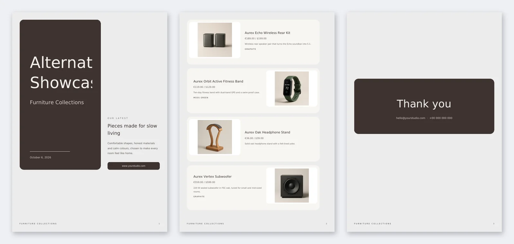
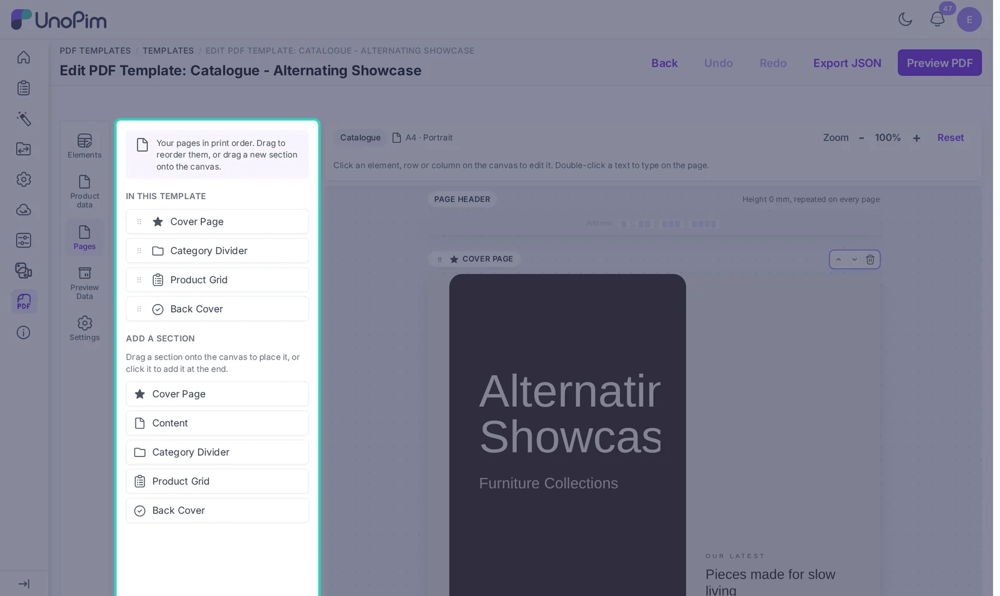
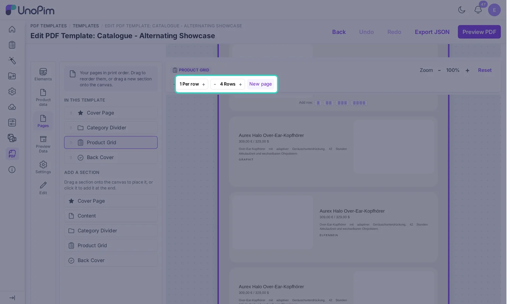
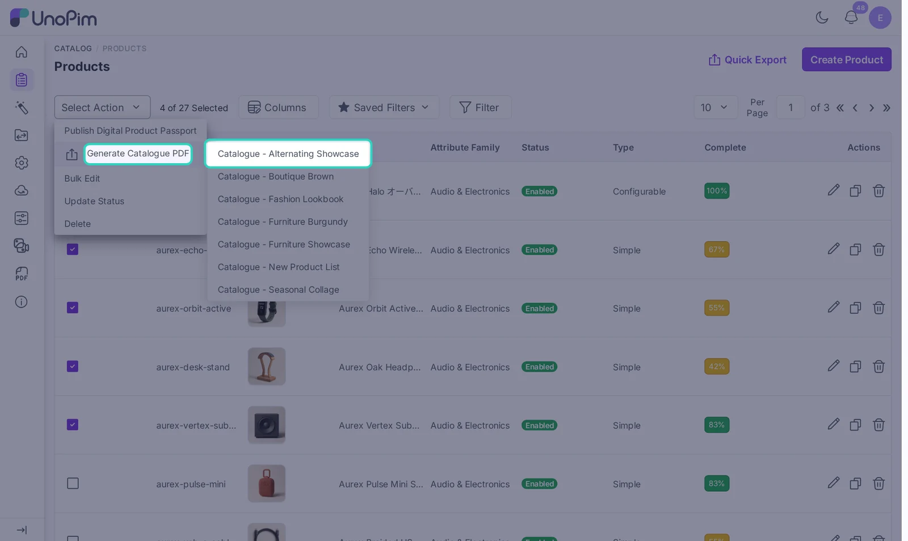
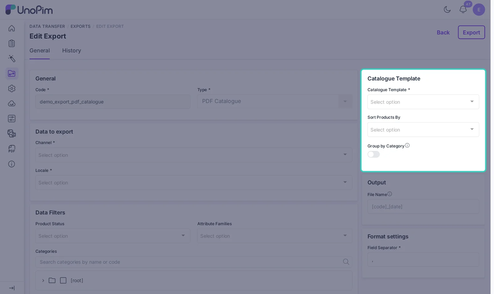
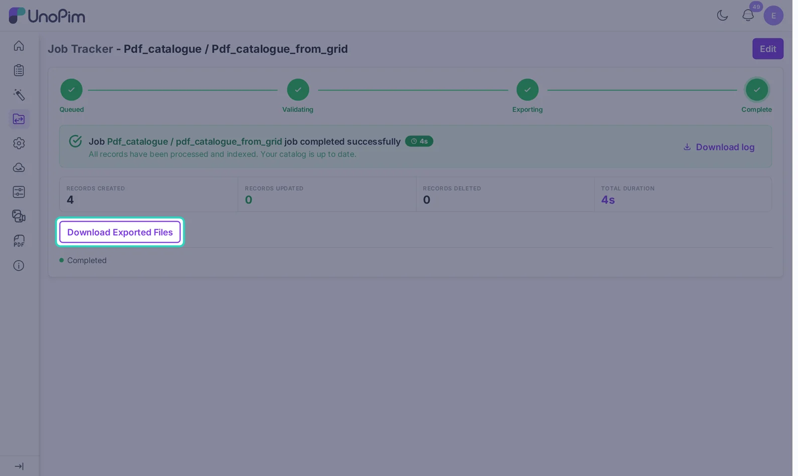

# Create a Catalogue

A catalogue is one PDF with many products in it. It can have a cover, category pages, a product grid and a back cover. Catalogues are built in the background, so you can keep working while UnoPim makes the file.

## 1. Set up the pages

Create a template with the type **Catalogue**, or duplicate one of the seven starter catalogues. Then open the **Pages** panel.

**In this template** lists your sections in print order. Drag a section by its handle to move it. **Add a section** lists the section types you can add. Drag one onto the canvas, or click it to add it at the end.

| Section | What it is for |
|---|---|
| **Cover Page** | The first page, with your title, logo and date |
| **Content** | Free pages for an intro, a brand story or terms |
| **Category Divider** | A page added before each category group |
| **Product Grid** | The products, laid out as cards |
| **Back Cover** | The last page, with contact details |

A template can have up to 20 sections. Each section starts on a new page by default. Turn off **Start on a new page** in the section settings to let it follow the one before it on the same page. The Pages list then marks it as **Same page**.

## 2. Design the product grid

Click **Product Grid** in the Pages list. The grid controls appear above the canvas.

- **Per row**: 1 to 4 products side by side.
- **Rows**: 1 to 6 rows of products per page.
- **New page**: start the grid on a fresh page, or let it follow the section above.

In the Edit panel you can also set:

- **Rows on the first page**: when the grid starts below another section, the first page has less room. Later pages use the full row count.
- **Gap (mm)**: the space between cards.
- **Alternate image side**: **Every other product** or **Every other row** flips the card columns, so images switch sides in a zig-zag layout.
- **Grid Panel** and **Product Card**: background, border, padding and corner radius.

You design only **one card**. UnoPim repeats it for every product. Put an Attribute Image in one column and the name, price and description in another, and every product follows the same layout.

> [!TIP]
> Use **Limit number of lines** on long descriptions. All cards then stay the same height and the pages look even.

## 3. Category divider pages

A **Category Divider** is added before each new category when the catalogue is grouped by category. Add a **System Field** set to **Group Name** to print the category name on it.

Grouping happens when you turn on **Group by Category** in an export profile, or when you sort by category.

## 4. Generate the catalogue

There are two ways to make the PDF.

### From the product grid

Use this for a quick catalogue of the products you pick.

1. Go to **Catalog > Products**.
2. Tick the products you want. You can also use select all, or filter the grid first.
3. Open **Select Action**, point at **Generate Catalogue PDF** and click a catalogue template.

UnoPim starts the job and opens the job tracker. Products appear in the order you selected them. The file is named `<template code>_<date>_<time>.pdf`.

### From an export profile

Use this for a catalogue you make again and again, like a monthly price list.

1. Go to **Data Transfer > Exports** and click **Create Export**.
2. Set **Type** to **PDF Catalogue**.
3. Fill in the profile:
   - **Catalogue Template**: the template to use.
   - **Channel** and **Locale**: the values to print.
   - **Sort Products By**: selection order, SKU, name or category.
   - **Group by Category**: adds a category divider page before each category.
   - **Data Filters**: product status, attribute families, categories, a list of SKUs and attribute conditions.
   - **File Name**: a pattern for the file name. You can use `[code]`, `[date]`, `[time]` and `[entity_type]`, for example `[code]_[date]`.
4. Save the profile and click **Export**.

## 5. Download the PDF

When the job is done, open it in **Data Transfer > Job Tracker** and click **Download Exported Files**.

## Limits and tips

- A catalogue can hold up to **1000 products**. UnoPim renders them in batches of 150 and joins the parts into one PDF.
- A queue worker must be running. If the job stays in **Queued**, start `php artisan queue:work`.
- Large catalogues with many images take longer the first time. Image copies are reused, so the next run is much faster.
- The **Generate Catalogue PDF** action only shows when at least one catalogue template exists and you have the **Catalogues > Generate** permission.
