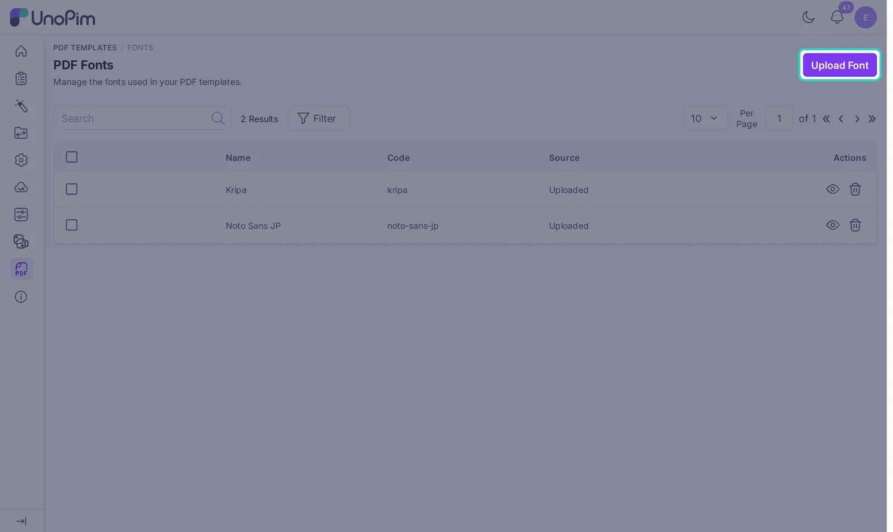
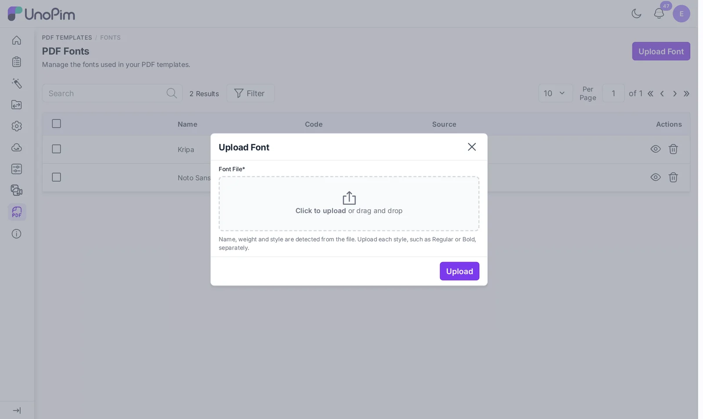
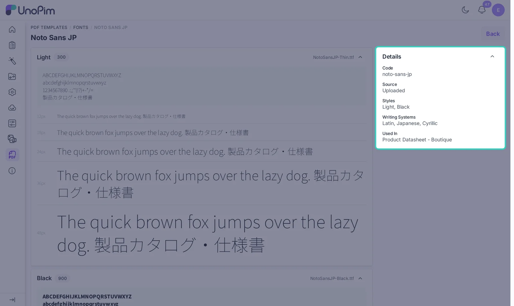

# Custom Fonts

Use your brand fonts in PDFs, or add fonts for languages like Japanese, Chinese, Korean or Hindi. Fonts are managed under **PDF Templates > Fonts**.

Three fonts are always there and need no upload: **Sans Serif**, **Serif** and **Monospace**.

## Upload a font

1. Go to **PDF Templates > Fonts**.
2. Click **Upload Font**.

3. Drop a `.ttf` file into the box, or click to pick one. The file can be up to 20 MB.
4. Click **Upload**.

You do not need to type a name. UnoPim reads the font family, the weight (like Regular or Bold) and the style (italic or not) from the file.

Each style is its own file. To use Regular and Bold, upload both files. When the family already exists, the new style is added to it.

## Which files work

| File | Result |
|---|---|
| TrueType font (`.ttf`) | Works |
| Font with CFF outlines (often `.otf`) | Rejected. Upload the TrueType version. |
| Variable font (one file for all weights) | Rejected. Upload a separate `.ttf` for each style. |
| A file you already uploaded | Rejected as a duplicate |

Many font sites, including Google Fonts, offer static `.ttf` files for each weight next to the variable font. Use those.

## Check a font

Click the eye icon next to a font to open its page. You see each uploaded style with sample text in every size, plus a **Details** box.

- **Writing Systems** lists the scripts the font can draw, such as Latin, Japanese, Cyrillic or Devanagari. The samples are shown in those scripts too.
- **Used In** lists the templates that use the font.

If your product names are in Japanese, check that **Japanese** is in the list. If a script is missing, those characters print as empty boxes.

## Use a font in a template

Open a template, click a text element and choose your font in the **Font** list of the Edit panel. To use it for the whole template, set it as the default font in **Settings > Page setup**.

Only the characters you use are embedded in the PDF. A large font, like a full Japanese font, does not make every PDF huge.

## Delete a font

Click the delete icon next to a font, or tick several fonts and use the mass delete action.

- A font used by a template cannot be deleted. The message tells you which templates use it. Change those templates first.
- The built-in fonts cannot be deleted.
