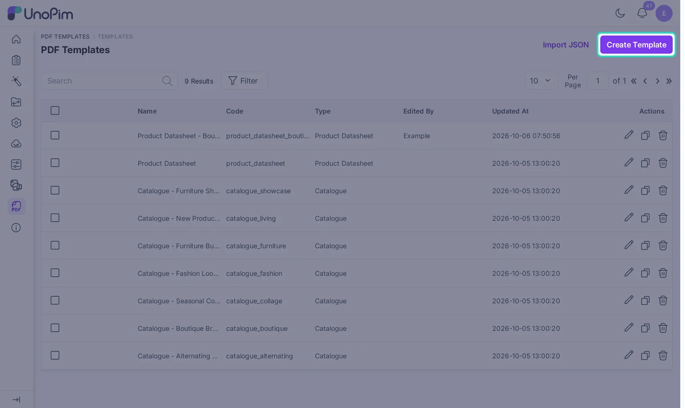
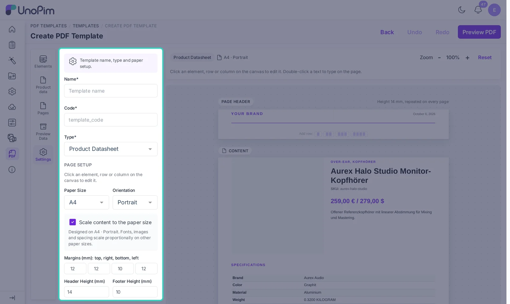
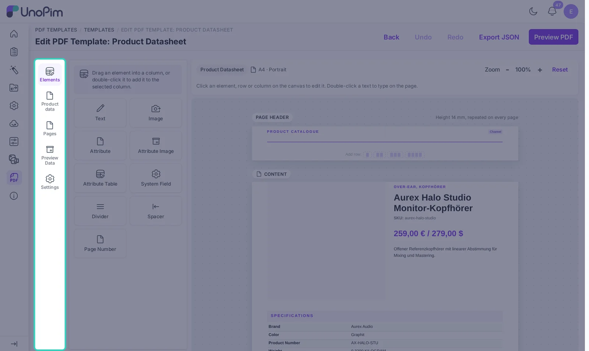
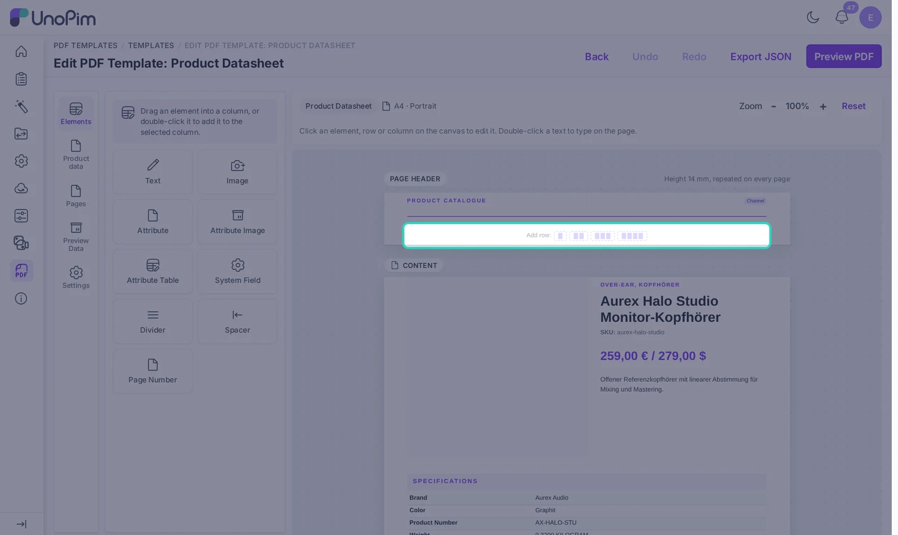
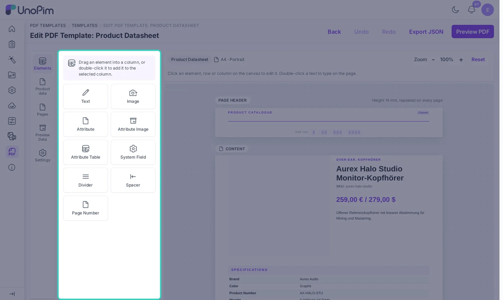
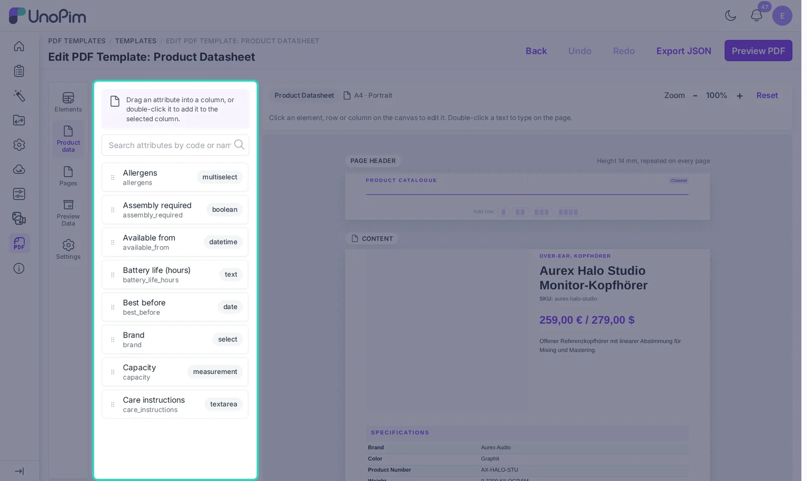
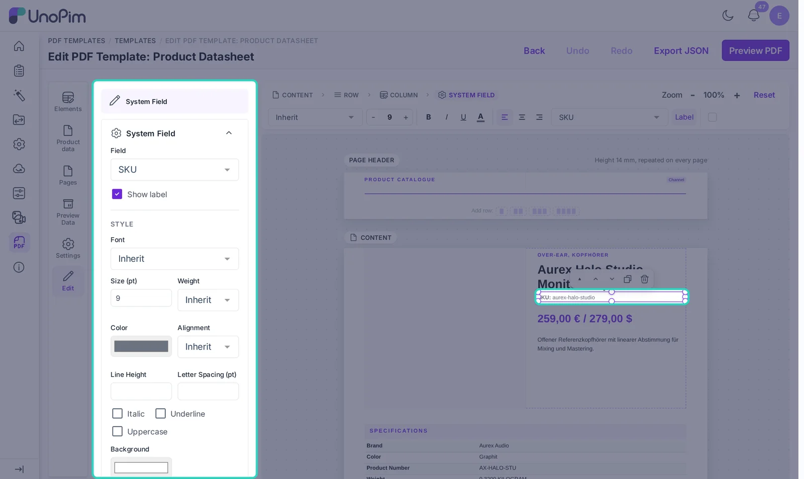
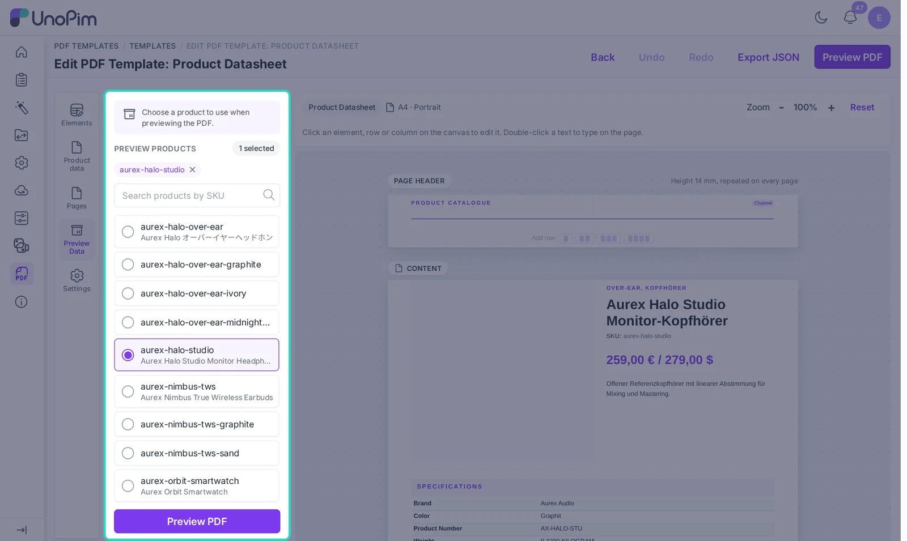
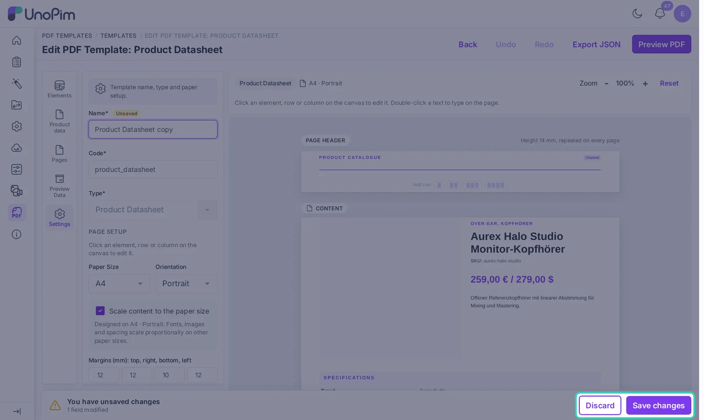

# Build a Template

Every PDF starts as a template. You build it once in the editor, and UnoPim fills in the product values each time you print.

## Create a template

1. Go to **PDF Templates > Templates**.
2. Click **Create Template**.

3. The editor opens on the **Settings** panel. Fill in:
   - **Name**: the name you will see in lists and menus.
   - **Code**: a unique code. It is filled in from the name, and you can change it.
   - **Type**: **Product Datasheet** for one product, or **Catalogue** for many. You cannot change the type after the first save.
4. Under **Page setup**, pick the paper size (A4, A5 or Letter), the orientation and the page margins in millimetres. You can also set the header and footer height, the page background colour or image, and the default font.

**Scale content to the paper size** is on by default. If you design on A4 and later print on Letter or landscape, fonts, images and spacing are scaled to fit.

> [!TIP]
> You do not have to start from a blank page. Open one of the nine starter templates, click the copy icon in the list to duplicate it, and edit the copy.

## Find your way around the editor

The editor has three parts: the panel buttons on the left, the open panel next to them, and the page canvas on the right.

| Panel | What it is for |
|---|---|
| **Elements** | Building blocks such as text, images and tables |
| **Product data** | All your UnoPim attributes, ready to drop on the page |
| **Pages** | The sections of the template, in print order |
| **Preview Data** | The sample products shown on the canvas |
| **Settings** | Name, type and page setup |
| **Edit** | Opens when you click something on the canvas |

The canvas shows the **Page Header** at the top and the **Page Footer** at the bottom. Whatever you put there repeats on every page of the PDF.

Use **Zoom** to make the page bigger or smaller. **Reset** brings it back to the default size.

## Add rows and columns

A page is made of rows, and each row is split into columns. Under every section you will find **Add row** with four buttons, for a row of 1, 2, 3 or 4 columns.

Click a column to select it. The bar above the canvas then lets you add a column to the left or right, remove a column, or change the column count. A row can have up to 12 columns.

Column widths are shared equally by default. To make one column wider, set its **Width (%)** in the Edit panel. Columns left at 0 share the rest of the width.

## Add elements

Open the **Elements** panel and drag an element into a column. You can also select a column first and double-click an element to add it there. On phones and tablets, a single tap adds it.

| Element | What it shows |
|---|---|
| **Text** | Your own text, such as a heading or a note. Double-click it on the canvas to type. |
| **Image** | A fixed image, like your logo. JPG, PNG or GIF, up to 5 MB. |
| **Attribute** | The value of one product attribute, with an optional label, prefix and suffix |
| **Attribute Image** | A product image, a gallery image or a DAM asset |
| **Attribute Table** | Many attributes as a two-column table of labels and values |
| **System Field** | SKU, categories, family, channel, locale, generated date or group name |
| **Divider** | A horizontal line |
| **Spacer** | Empty space between elements |
| **Page Number** | Text such as `Page {page} of {pages}` |

## Add product attributes

Open **Product data** to see every attribute in UnoPim. Type in the search box to find one by code or name. The badge on the right shows the attribute type.

Drag an attribute into a column. The editor picks the right element for you: an image attribute becomes an **Attribute Image**, and other types become an **Attribute**.

To learn how each attribute type looks in the PDF, see [Product Data in Templates](./product-identification).

## Style an element

Click any element on the canvas. The **Edit** panel opens with its settings, and a small bar above the canvas gives you quick controls like font, size, bold and alignment.

In the **Style** part of the Edit panel you can set:

- Font, size (pt), weight, italic, underline and uppercase
- Text colour and background colour
- Alignment, vertical alignment, line height and letter spacing
- Padding and margin in millimetres
- Border width, border colour and corner radius

The panel also shows the row and column that hold the element, so you can style those too. The buttons on the selected element let you move it up or down, duplicate it or delete it.

Made a mistake? Press **Ctrl+Z** to undo and **Ctrl+Y** to redo, or use the **Undo** and **Redo** buttons at the top. The editor keeps your last 60 steps.

## Preview with real products

Open **Preview Data** and pick the product to show on the canvas. For a catalogue, you can pick several products. Search by SKU to find one fast.

Click **Preview PDF** to see the real PDF in a pop-up window. It uses your current design, even before you save, and you can preview up to 30 products.

## Save your template

As soon as you change something, a bar appears at the bottom of the page. Click **Save changes** to save, or **Discard** to go back to the last saved version.

If you try to leave the page with unsaved changes, UnoPim warns you first.
