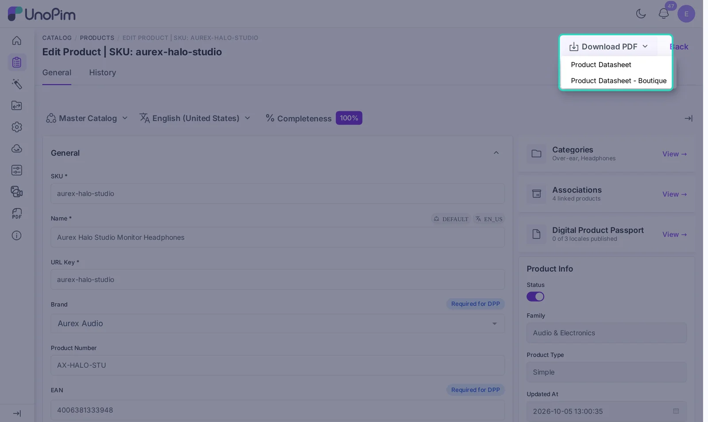
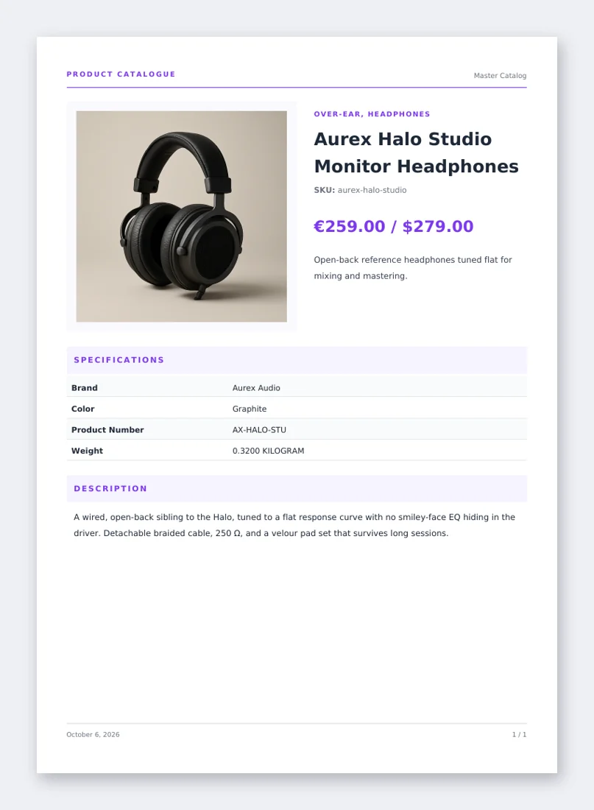

# Download a Product Datasheet

A product datasheet is a PDF for one product. Once you have a **Product Datasheet** template, anyone with access can download it from the product page.

## Steps

1. Go to **Catalog > Products** and open the product you want.
2. At the top of the page, pick the **channel** and **locale** you want in the PDF. The datasheet uses the values for that channel and locale.
3. Click **Download PDF**. The list shows all your Product Datasheet templates.
4. Click a template. The PDF downloads right away.

Here is a datasheet made with the starter **Product Datasheet** template:

## Good to know

- Only **Product Datasheet** templates show in this menu. Catalogue templates are used from the product grid and from exports. See [Create a Catalogue](./create-catalogue).
- If the menu says **No PDF template available**, create a Product Datasheet template first, or duplicate the starter one.
- The **Download PDF** button needs the **Download PDF** permission. Without it, the button is hidden.
- Not happy with the layout? Open the template under **PDF Templates > Templates**, change it and save. The next download uses the new design.
