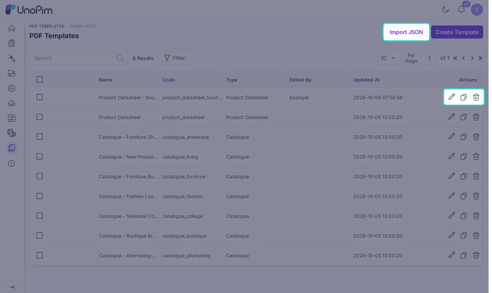

# Manage Templates

All templates live under **PDF Templates > Templates**. From here you can search, edit, copy, share and delete them.



## Find a template

Type in **Search** to find a template by name or code. Use **Filter** to show only Product Datasheet or only Catalogue templates. Click a column title to sort.

## Edit, duplicate and delete

Each row has three icons:

- **Edit** (pencil): opens the template in the editor.
- **Duplicate** (copy): makes a copy named "Copy of ...". This is the safest way to try a new design or to start from a starter template.
- **Delete** (bin): removes the template.

To delete many templates at once, tick them and use the mass delete action.

## Starter templates

Nine templates come with the module, so you never start from an empty page:

| Type | Templates |
|---|---|
| Catalogue | Alternating Showcase, Boutique Brown, Seasonal Collage, Fashion Lookbook, Furniture Burgundy, New Product List, Furniture Showcase |
| Product Datasheet | Product Datasheet, Product Datasheet - Boutique |

Deleted a starter template and want it back? Run `php artisan pdftemplate:templates:install`. It only adds the missing ones.

## Move templates between systems

You can copy a template from one UnoPim to another, for example from a test server to your live server.

1. Open the template and click **Export JSON** at the top of the editor. A `.json` file downloads.
2. On the other UnoPim, go to **PDF Templates > Templates** and click **Import JSON**.
3. Pick the file. The template is added to the list.

The JSON file holds the layout and settings. Make sure the attributes and custom fonts the template uses also exist on the other system.

## Templates from the old builder

If you used version 1.x, your old templates are converted to the new builder when you update. If something in an old template could not be converted, such as raw template code, it is left out and the rest of the layout is kept. Open each converted template, check it and save it.

You can run the conversion again with:

```bash
php artisan pdftemplate:templates:convert-legacy
```

## Permissions

Control who can do what in **Settings > Roles**. Edit a role and tick the permissions it needs.

| Permission | What it allows |
|---|---|
| **PDF Templates** | See the PDF Templates menu |
| **Templates** > View, Create, Edit, Delete, Mass Delete, Export | Work with templates. Create covers Import JSON, and Export covers Export JSON. |
| **Fonts** > View, Upload, Delete, Mass Delete | Work with fonts |
| **Catalogues** > Generate | Use **Generate Catalogue PDF** on the product grid |
| **Download PDF** | See **Download PDF** on the product edit page |

For example, a sales user who only prints datasheets needs just **Download PDF**. A designer needs **Templates** and **Fonts**.
