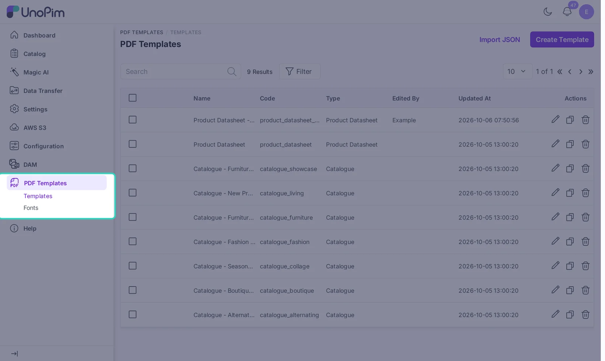

# Installation

Follow these steps to install the PDF Generator in your UnoPim project. Run every command from the UnoPim root folder.

## 1. Add the package files

1. Download the package and unzip it.
2. Copy the `PdfTemplate` folder into `packages/Webkul` in your UnoPim project.

The path should look like this:

```text
packages/Webkul/PdfTemplate
```

Keep the folder name exactly `PdfTemplate`. The namespace and the autoload entry depend on it.

## 2. Register the namespace

Open `composer.json` and add this line under `autoload` > `psr-4`:

```json
"Webkul\\PdfTemplate\\": "packages/Webkul/PdfTemplate/src"
```

## 3. Register the service provider

Open `bootstrap/providers.php` and add this line to the providers array:

```php
Webkul\PdfTemplate\Providers\PdfTemplateServiceProvider::class,
```

## 4. Run the install command

```bash
php artisan pdf-generator:install
```

This one command does the full setup for you:

| Step | What it does |
|---|---|
| `composer dump-autoload` | Loads the new `Webkul\PdfTemplate` namespace |
| `php artisan optimize:clear` | Clears cached config, routes and views |
| `php artisan migrate --force` | Creates the tables and adds the nine starter templates |
| `php artisan vendor:publish` | Publishes the editor styles, scripts and fonts |

If a step fails, the command tells you which one. Run that step by hand to see the full error.

## 5. Start the queue worker

Catalogues are built in the background, so keep a queue worker running:

```bash
php artisan queue:work
```

On a live server, run the worker with Supervisor or a similar process manager so it restarts on its own.

## 6. Check the menu

Sign in to the admin. You will see **PDF Templates** in the left menu, with **Templates** and **Fonts** under it.



Admins see the menu right away. To give other users access, open **Settings > Roles** and tick the PDF Templates permissions. See [Manage Templates](./manage-templates#permissions) for the full list.

## Update from an older version

1. Replace the `packages/Webkul/PdfTemplate` folder with the new one.
2. Run:

```bash
php artisan pdf-generator:install
php artisan pdftemplate:templates:install
```

Templates made in the old builder are converted to the new builder during the migration. The second command adds any starter templates that are new in this version. It never changes templates you already have.

## Commands

| Command | What it does |
|---|---|
| `php artisan pdf-generator:install` | Installs or updates the package |
| `php artisan pdftemplate:templates:install` | Adds the starter templates that are missing |
| `php artisan pdftemplate:fonts:install` | Rebuilds the font files used to render PDFs |
| `php artisan pdftemplate:templates:convert-legacy` | Converts templates saved by the old builder |

## Troubleshooting

- **The menu does not show up.** Run `php artisan optimize:clear`, then check the provider line and the `composer.json` entry.
- **The editor looks broken or has no styles.** The assets were not published. Run `php artisan vendor:publish --provider="Webkul\PdfTemplate\Providers\PdfTemplateServiceProvider" --force`.
- **A catalogue stays in the queue.** No queue worker is running. Start `php artisan queue:work`.
- **Text in a custom font shows as boxes.** Run `php artisan pdftemplate:fonts:install` to rebuild the font files.
